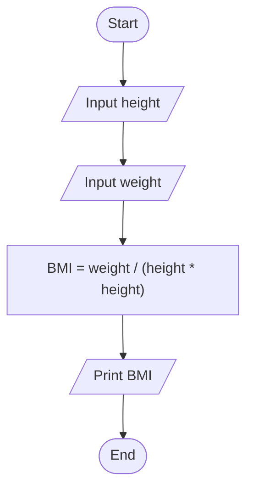

# Problem Analysis
### Problem Description
Make a program that calculates and display the Body Mass Index (BMI) of a person. The program should read the height and weight of a person being given and displays the BMI.  
BMI = weight(in kg) / (height * height(in m))

### Problem Analysis
###### Input
- height
- weight
###### Output
- BMI
###### Process/Operation
- Variable declaration - holds input and output
- Print input prompt message and read input data
- Calculate the BMI:
        BMI = weight / (height * height)
- Print output message and result

# Algorithm Design/Pseudocode
Step 1: Start  
Step 2: Input height  
Step 3: Input weight  
Step 4: Calculate BMI = weight / (height * height)  
Step 5: Print BMI  
Step 6: End  

### Flowchart

