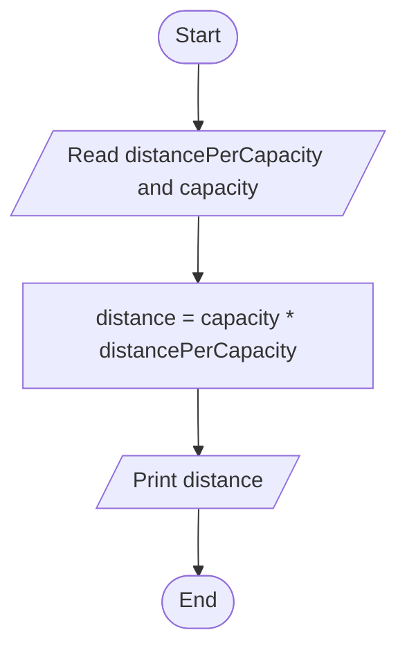

# Problem Analysis

### Problem Discription

Write a program that prompts the capacity in gallons of an automobile fuel tank and the miles per gallons the automobiles can be driven. The program outputs the number miles the automobile can be driven without refueling. 
**distance_driven = capacity \* distancePerCapacity**

###### Input

- capacity of the fuel tank
- distance per capacity

###### Output

- distance it can be driven without refueling

###### Process/Operation

- Variable declaration - input and output
- Print input prompt message and read input
- Calculate distance_driven: capacity \* distancePerCapacity
- Print output prompt and result

# Algorithm Design/Pseudocode

**Step 1:** Start  
**Step 2:** Read distancePerCapacity and capacity of the automobile  
**Step 3:** Calculate distance: capacity * distancePerCapacity  
**Step 4:** Print distance  
**Step 5:** End  

### Flowchart

