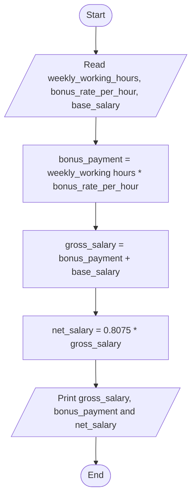

# Problem Analysis
### Problem Description
Design an algorithm and write a to read an employee name weekly working hours, bonus rate per hour and base salary and find the employees gross-salary, net salary and bonus payment.
### Problem Analysis
###### Input
- weekly working hours
- bonus rate per hour
- base salary
###### Output
- gross-salary
- net salary
- bonus payment
###### Process/Operation
- Variable declaration - input and output
- Read inputs
- Calculate bonus_payment = weekly_working_hours * bonus_rate_per_hour
- Calculate gross salary = bonus_payment + base_salary
- Calculate net_salary = gross_salary - (0.05 * gross_salary) - (.15 * gross_salary) = 0.8 * gross_salary
- Print results

# Algorithm Design/Pseudocode
Step 1: Start  
Step 2: Read weekly_working_hours, bonus_rate_per_hour, base_salary  
Step 3: Calculate bonus_payment = weekly_working_hours * bonus_rate_per_hour  
Step 4: Calculate gross_salary = bonus_payment + base_salary  
Step 5: Calculate net_salary = 0.8075 * gross_salary  
Step 6: Print gross_salary, bonus_payment and net_salary  
Step 7: End

### Flowchart 

