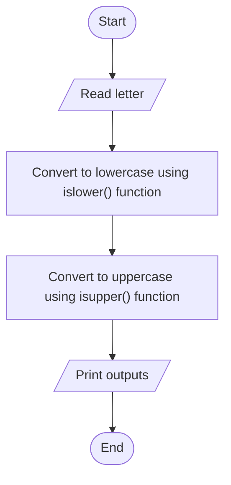

# Problem Analysis
### Problem Description
Write a program that converts a letter entered from the keyboard to its uppercase or lowercase equivalent.

###### Input
- a letter
###### Output
- uppercase or lowercase equivalent of the letter
###### Process/Operation
- Variable declaration - input and output
- Read input
- use islower() and isupper() functions to switch to lower or uppercase equivalents
- Print output

# Algorithm Design
**Step 1:** Start  
**Step 2:** Read letter  
**Step 3:** Convert it to lowercase or uppercase using islower() and isupper() functions  
**Step 4:** Print output  
**Step 5:** End  

### Flowchart

