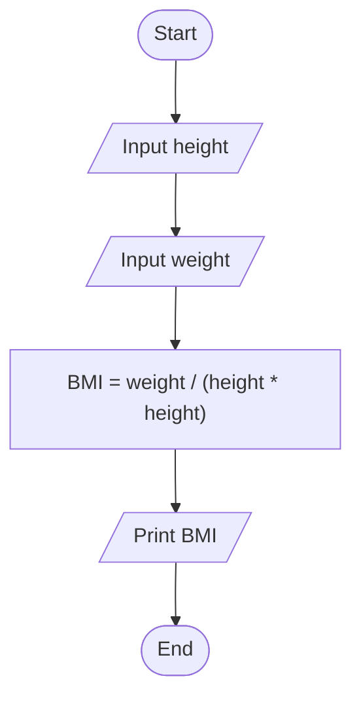
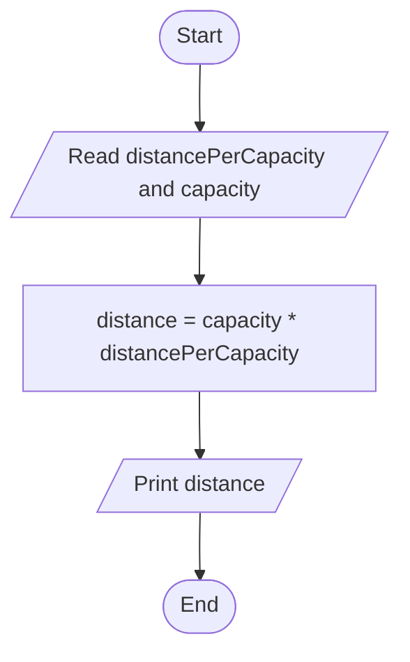
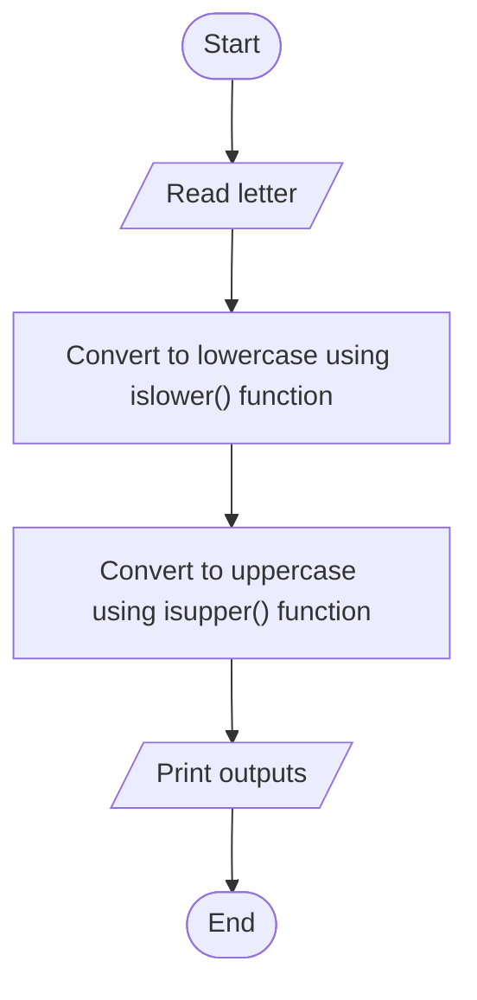
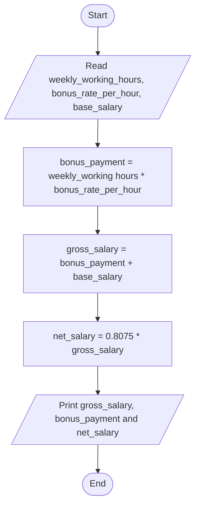
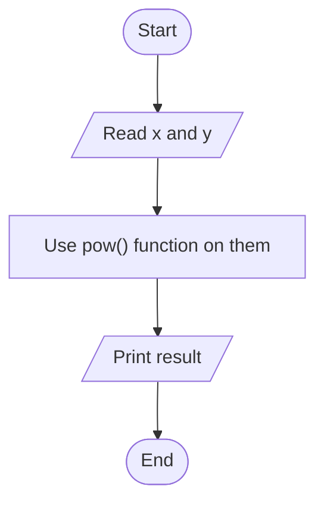

#Flowchart
1



2



3



4


5



6
```mermaid
  flowchart TD
A([Start]) --> B[/Read file_size/];
B -6
```mermaid
  flowchart TD
A([Start]) --> B[/Read letter/];
B --> C["Convert to lowercase using islower() function"];
C --> D["Convert to uppercase using isupper() function"];
D --> E[/Print outputs/];
E --> F([End]);
```-> C["time_taken = file_size / byte_per_second"];
C --> D[/Print time_taken/];
D --> E([End]);
```


